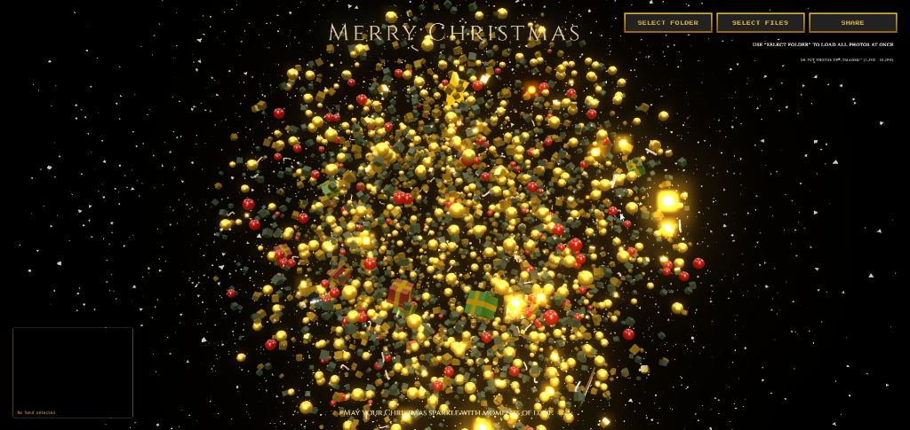

# 🎄 Magical 3D Christmas Tree

Message your friends and family with a unique, mesmerizing 3D interactive Christmas Tree experience! Powered by **Tree.js** and **MediaPipe**, this project brings the holiday spirit to your screen with gesture controls, personalized wishes, and photo memories.

> [!NOTE] > **Recommended for Desktop/PC**
> This application is heavily optimized for desktop screens with webcam support for the full gesture control experience. Mobile access is available but functionality is limited.

## ✨ Live Demo

**[👉 Experience the Magic Here](https://caythongnoem.vercel.app/)**

---

## 📸 Gallery

Experience the magic of a 3D interactive Christmas!

|                                       |                                           |
| :-----------------------------------: | :---------------------------------------: |
|  |  |

---

## 🌟 Key Features

### 🖥️ Desktop (PC) - The Full Experience

- **Gesture Control**: Use your webcam to interact with the tree.
  - 🖐️ **Open Hand**: "Explode" the tree into a galaxy of floating lights and ornaments.
  - 👌 **Pinch**: Grab specific gift boxes or focus on photo memories.
  - 🤏 **Pinch & Hold**: Open gifts to reveal 3D surprises.
- **High-Fidelity Visuals**: Enhanced bloom effects, dynamic lighting, and smooth rotational physics.

### ⚠️ Mobile (Restricted)

- **Limited Interaction**: Basic touch support allows for viewing, but advanced gesture magic and heavy particle effects are disabled for performance.
- **View Only**: Designed primarily for quick viewing of the tree structure.

### 🎨 Core Features

- **Personalized Wishes**: Generate custom URLs (e.g., `?name=YourName`) to send addressed greetings.
- **Photo Memories**: Upload your own photos to decorate the tree!
- **Music & Atmosphere**: Integrated festive background music and sound effects.

---

## 🚀 Usage Guide

### 📤 Decorate with Your Memories

You can hang your own photos on the tree!

1.  Click **"Select Folder"** to upload an entire album at once.
2.  Click **"Select Files"** to pick specific images (`.jpg`, `.png`).
3.  Your photos will automatically appear as glowing ornaments on the tree.

### 💌 Share the Magic

Create a personalized greeting for someone special:

1.  Click the **"SHARE"** button.
2.  Enter the recipient's name (e.g., "Alice").
3.  A custom link and festive message will be **copied to your clipboard**.
4.  Paste it to send it to your friend!

### ⌨️ Controls

- **`H` Key**: Toggle the UI and Webcam view (Hide/Show) for a cinematic screenshot mode.

---

## 🛠️ Tech Stack

- **[Three.js](https://threejs.org/)**: The core 3D engine for rendering the tree, particles, and post-processing (Unreal Bloom).
- **[MediaPipe](https://developers.google.com/mediapipe)**: (PC Only) AI-powered hand tracking for gesture recognition.
- **Vanilla JavaScript**: Built for maximum performance with no heavy framework overhead.
- **Vercel**: Optimized for instant global deployment.

---

## 📦 Getting Started

1.  **Clone the repository**

    ```bash
    git clone https://github.com/tanbaycu/christmas-tree.git
    cd christmas-tree
    ```

2.  **Run Locally**

    - Since this uses ES6 modules and Webcam access, you strictly need a local server.
    - **VS Code**: Right-click `index.html` -> _Open with Live Server_.
    - **Python**:
      ```bash
      python -m http.server 8000
      # Open localhost:8000 in Chrome
      ```

3.  **Customization**
    - Replace images in the `assets/` folder to change the default decorations.
    - Modify `greetings` in `script.js` to change the random messages.

---

[](https://star-history.com/#tanbaycu/christmas-tree&Date)

## 🤝 Contributing & Support

If you enjoyed this project or used it to send a Christmas wish, please consider **giving it a star! ⭐️**

_Developed with ❤️ by [tanbaycu](https://github.com/tanbaycu)_
